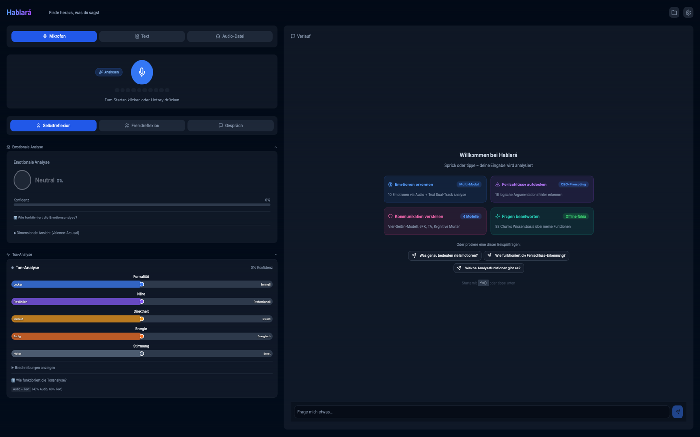
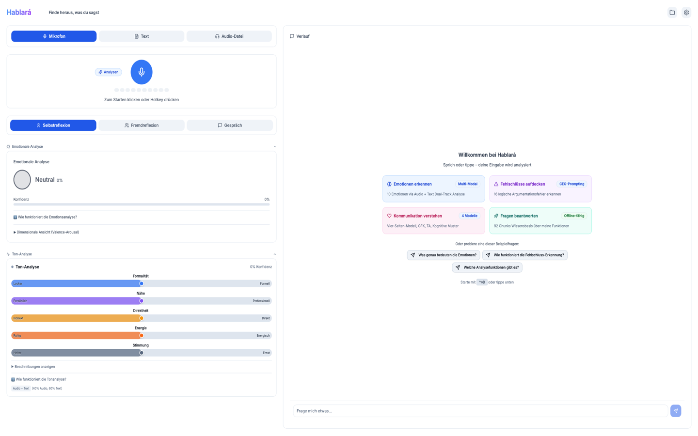

# Hablará – „Er/sie wird sprechen"

> **Finde heraus, was du sagst**

[](LICENSE)
[][releases]
[][releases]
[](https://apps.apple.com/de/app/hablar%C3%A1/id6758584671)
[](https://apps.apple.com/app/hablara-pro/id6761668056)
[](https://apps.microsoft.com/detail/9NC1V6BLKCDX)
[](https://apps.microsoft.com/detail/9PLKW97M4830)
[](https://snapcraft.io/hablara)
[](https://tauri.app/)
[](https://github.com/fidpa/homebrew-hablara)
[](https://community.chocolatey.org/packages/hablara-free)
[](https://github.com/fidpa/hablara#funktionen)

Desktop-App für Selbstreflexion mit Spracherkennung und KI-gestützter Sprachanalyse.

Transkription lokal (whisper.cpp) oder optional via Cloud (OpenAI Whisper API).

Sprachanalyse wahlweise lokal (Ollama) oder via Cloud (OpenAI/Anthropic).

<table>
  <tr>
    <td></td>
    <td></td>
  </tr>
</table>

## Inhalt

- [Plattformen](#plattformen)
- [Installation](#installation)
- [Funktionen](#funktionen)
- [Architektur](#architektur)
- [Datenschutz](#datenschutz)
- [Vergleich](#vergleich)
- [Mitwirken](#mitwirken)
- [Lizenz](#lizenz)

---

## Plattformen

| Plattform | Status | Architektur | Hinweise |
|----------|--------|--------------|-------|
| **macOS** | ✅ Verfügbar (App Store + Homebrew) | ARM64 (Apple Silicon) | MLX-Whisper verfügbar |
| **macOS** | ✅ Verfügbar (App Store + Homebrew) | x86_64 (Intel) | Kein MLX-Whisper |
| **Windows** | ✅ Verfügbar | x86_64 | whisper.cpp CPU, kein MLX, WASAPI Audio |
| **Linux** | ✅ Verfügbar | x86_64 | Ubuntu 20.04+, .deb/.rpm/.AppImage |
| **Linux** | ✅ Verfügbar | ARM64 | Asahi Linux (Apple Silicon), .deb/.rpm/.AppImage |

> **Hinweis:** macOS (ARM64) ist die primäre Entwicklungsplattform.

### Feature-Verfügbarkeit nach Plattform

| Feature | macOS ARM64 | macOS x64 | Windows x64 | Linux x64 |
|---------|-------------|-----------|-------------|-----------|
| whisper.cpp | ✅ | ✅ | ✅ | ✅ |
| MLX-Whisper | ✅ | ❌ | ❌ | ❌ |
| OpenAI Cloud STT | ✅ | ✅ | ✅ | ✅ |
| Ollama LLM | ✅ | ✅ | ✅ | ✅ |
| OpenAI/Anthropic | ✅ | ✅ | ✅ | ✅ |
| Global Hotkey | ✅ | ✅ | ✅ | ✅ |
| Schnellaufnahme | ✅ | ✅ | ❌ | ✅ |
| Native Audio | CoreAudio | CoreAudio | WASAPI | ALSA/PipeWire |
| API Key Storage | Keychain | Keychain | Credential Manager | Secret Service |
| Auto-Update | ❌ | ❌ | ❌ | ✅ |
| System-Tray | ✅ | ✅ | ✅ | ✅ |

---

## Installation

**Hinweis:** Ohne LLM-Anbieter funktioniert nur die Transkription. Alle psychologischen Features benötigen Ollama, OpenAI, Anthropic oder Mistral.

---

###  Installation

**Voraussetzungen:** macOS 10.15+ · Internetverbindung für den ersten Start (Modell-Download)

#### App Store (empfohlen)

**[Hablará (Free)](https://apps.apple.com/de/app/hablar%C3%A1/id6758584671)** · **[Hablará Pro](https://apps.apple.com/app/hablara-pro/id6761668056)**

- Free: Transkription, Emotionserkennung, Tonalität, Themen-Klassifikation, Bibelimpuls
- Pro: Alle psychologischen Analysen (GFK, CBT, Vier-Seiten, TA, Bewertungsanalyse, Regulatorischer Fokus, Fehlschlüsse, Coaching)
- Automatische Updates über den App Store
- Sandboxing-Sicherheit
- Globaler Hotkey (Ctrl+Shift+D) nicht verfügbar

#### Homebrew (Free)

```bash
brew install --cask fidpa/hablara/hablara
```

Updates: `brew upgrade --cask hablara`

#### Ollama + Sprachmodell installieren (empfohlen)

```bash
curl -fsSL https://raw.githubusercontent.com/fidpa/hablara-releases/main/scripts/setup-ollama-mac.sh | bash
```

<details>
<summary>📋 Was macht dieser Befehl?</summary>

1. Installiert Ollama (falls nicht vorhanden)
2. **Modellauswahl:** 1.5b (ultra-leicht, schwache Hardware), 3b (schnell, Standard), 7b (gute Qualität), qwen3-8b (Premium, 100% JSON)
3. Erstellt optimiertes Custom-Modell
4. Verifiziert Installation

</details>

---

###  Installation

**Voraussetzungen:** Ubuntu 20.04+ / Debian 11+ / Fedora 36+ · x64 oder ARM64 · Internetverbindung für den ersten Start (Modell-Download)

**Empfohlen:** APT Repository (Debian/Ubuntu) — oder [GitHub Releases][releases] (.deb/.rpm/.AppImage)

#### 1️⃣ Hablará installieren

**Debian/Ubuntu — APT Repository (empfohlen):**
```bash
curl -fsSL https://fidpa.github.io/hablara-apt/pubkey.asc \
  | sudo gpg --dearmor -o /usr/share/keyrings/hablara-archive-keyring.gpg

echo "Types: deb
URIs: https://fidpa.github.io/hablara-apt
Suites: stable
Components: main
Architectures: amd64 arm64
Signed-By: /usr/share/keyrings/hablara-archive-keyring.gpg" \
  | sudo tee /etc/apt/sources.list.d/hablara.sources

sudo apt update && sudo apt install hablara
```

Updates danach via `sudo apt update && sudo apt upgrade`.

<details>
<summary>📋 Manuelle Installation (.deb, .rpm, AppImage)</summary>

Paket von [GitHub Releases][releases] herunterladen — x64 (`amd64`) oder ARM64 (`arm64`/`aarch64`).

**Debian/Ubuntu (.deb):**
```bash
sudo dpkg -i Hablara_<VERSION>_amd64.deb  # oder _arm64.deb
sudo apt-get install -f  # Falls Abhängigkeiten fehlen
```

> **Tipp:** Die .deb-Installation registriert das APT Repository automatisch — Updates danach via `sudo apt upgrade`.

**Fedora/RHEL (.rpm):**
```bash
sudo dnf install Hablara-<VERSION>.x86_64.rpm
# ARM64: sudo dnf install Hablara-<VERSION>.aarch64.rpm
```

**AppImage (Universal, keine Installation nötig):**
```bash
chmod +x Hablara_<VERSION>_amd64.AppImage && ./Hablara_<VERSION>_amd64.AppImage
```

AppImages können mit [AppImageLauncher](https://github.com/TheAssassin/AppImageLauncher) ins Anwendungsmenü integriert werden.

</details>

#### 2️⃣ Ollama + Sprachmodell installieren (empfohlen)

```bash
curl -fsSL https://raw.githubusercontent.com/fidpa/hablara-releases/main/scripts/setup-ollama-linux.sh | bash
```

<details>
<summary>📋 Was macht dieser Befehl?</summary>

1. Installiert Ollama (falls nicht vorhanden)
2. **Modellauswahl:** 1.5b (ultra-leicht, schwache Hardware), 3b (schnell, Standard), 7b (gute Qualität), qwen3-8b (Premium, 100% JSON)
3. Erstellt optimiertes Custom-Modell
4. Verifiziert Installation

</details>

#### 3️⃣ API Key Speicherung (OpenAI/Anthropic)

**Cloud-Provider (OpenAI/Anthropic) benötigen einen Schlüsselbund-Dienst:**

<details>
<summary>📋 Benötigte Pakete nach Desktop-Umgebung</summary>

**GNOME (Standard bei Ubuntu, Fedora, Debian):**
```bash
# Meist bereits installiert
sudo apt install gnome-keyring  # Debian/Ubuntu
sudo dnf install gnome-keyring  # Fedora/RHEL
```

**KDE Plasma 6 (2024+):**
```bash
sudo apt install kwalletmanager  # Debian/Ubuntu
sudo dnf install kwalletmanager  # Fedora/RHEL
# Plasma 6 nutzt ksecretd (Secret Service native, voll kompatibel)
```

**KDE Plasma 5 (älter):**
```bash
sudo apt install kwalletmanager  # Debian/Ubuntu
sudo dnf install kwalletmanager  # Fedora/RHEL
# Plasma 5 benötigt Secret Service Bridge-Aktivierung in KWallet-Einstellungen
```

**Minimal Window Managers (i3, bspwm, etc.):**
```bash
# Manuelle Installation von GNOME Keyring (auch ohne GNOME Desktop)
sudo apt install gnome-keyring libsecret-1-0  # Debian/Ubuntu
sudo dnf install gnome-keyring libsecret      # Fedora/RHEL

# Daemon manuell starten (falls nicht automatisch):
eval $(gnome-keyring-daemon --start --components=secrets)
```

**KeePassXC (Alternative für alle Desktop-Umgebungen):**
```bash
sudo apt install keepassxc  # Debian/Ubuntu
sudo dnf install keepassxc  # Fedora/RHEL
# KeePassXC → Einstellungen → Secret Service Integration aktivieren
```

</details>

**Snap Store:**
```bash
sudo snap install hablara
```
Nach Installation Mikrofon-Zugriff verbinden (bis Auto-Connect genehmigt):
```bash
sudo snap connect hablara:audio-record
```

**Troubleshooting:**
- Fehler "Kein Schlüsselbund-Dienst gefunden" → Paket installieren (siehe oben)
- Fehler "Schlüsselbund antwortet nicht" → Daemon starten: `gnome-keyring-daemon --start`
- KDE: Secret Service in KWallet aktivieren: `systemsettings5` → Wallet → "Enable Secret Service"

---

###  Installation

**Voraussetzungen:** Windows 10/11 (x64) · Internetverbindung für den ersten Start (Modell-Download)

#### Microsoft Store (empfohlen)

**[Hablará (Free)](https://apps.microsoft.com/detail/9NC1V6BLKCDX)** · **[Hablará Pro](https://apps.microsoft.com/detail/9PLKW97M4830)**

- Free: Transkription, Emotionserkennung, Tonalität, Themen-Klassifikation, Bibelimpuls
- Pro: Alle psychologischen Analysen (GFK, CBT, Vier-Seiten, TA, Bewertungsanalyse, Regulatorischer Fokus, Fehlschlüsse, Coaching)
- Automatische Updates über den Store
- Keine SmartScreen-Warnung

#### Chocolatey

```powershell
choco install hablara-free
```

Automatische Updates via `choco upgrade hablara-free`.

#### Direct Distribution

**Download:** [GitHub Releases][releases] – NSIS Installer (~160 MB) | MSI (~160 MB)

#### 1️⃣ Hablará installieren
- `.exe` oder `.msi` herunterladen und ausführen
- **Windows Defender SmartScreen:** "Weitere Informationen" → "Trotzdem ausführen"
  _(App ist nicht signiert – [Warum? Ist das sicher?](docs/guides/FAQ.md#13-windows-smartscreen-warnung))_

#### 2️⃣ Ollama + Sprachmodell installieren (empfohlen)

**Einmalige Vorbereitung:**
```powershell
Set-ExecutionPolicy -ExecutionPolicy RemoteSigned -Scope CurrentUser
```

**Setup-Skript ausführen:**
```powershell
Invoke-WebRequest -Uri "https://raw.githubusercontent.com/fidpa/hablara-releases/main/scripts/setup-ollama-win.ps1" -OutFile "$env:TEMP\setup-ollama-win.ps1"; & "$env:TEMP\setup-ollama-win.ps1"
```

<details>
<summary>📋 Was macht dieser Befehl?</summary>

1. Installiert Ollama via winget (falls nicht vorhanden)
2. **Modellauswahl:** 1.5b (ultra-leicht, schwache Hardware), 3b (schnell, Standard), 7b (gute Qualität), qwen3-8b (Premium, 100% JSON)
3. Erstellt optimiertes Custom-Modell
4. Verifiziert Installation

</details>

---

<details>
<summary>Alternative: Cloud-LLM (OpenAI/Anthropic)</summary>

1. **Hablará öffnen** → Einstellungen (Zahnrad-Icon) → KI-Modelle
2. **Anbieter wählen**: OpenAI oder Anthropic
3. **API Key eingeben**:
   - OpenAI: [platform.openai.com/api-keys](https://platform.openai.com/api-keys)
   - Anthropic: [console.anthropic.com/settings/keys](https://console.anthropic.com/settings/keys)

Cloud-LLM erfordert DSGVO-Einwilligung (wird beim ersten Start abgefragt)

**Tipp:** Ein OpenAI API Key reicht für beide Dienste — Analyse (GPT-4o-mini) und Cloud-Transkription (Whisper API).

</details>

---

## Funktionen

- **Hotkey-Aktivierung** – Starte die Aufnahme mit Ctrl+Shift+D aus jeder Anwendung
- **Hintergrund-Betrieb** – App läuft im System-Tray weiter, auch wenn das Fenster geschlossen wird. Hotkey bleibt jederzeit aktiv. Autostart optional
- **Native Audio-Aufnahme** – Professionelle Audioqualität für präzise Transkription (cpal @ 16kHz)
- **Lokale Transkription** – Audio-Daten bleiben auf dem Gerät
- **Cloud-Transkription (optional)** – OpenAI Whisper API als Alternative (whisper-1 / gpt-4o-mini-transcribe), nutzt denselben API Key wie die Textanalyse. Erfordert DSGVO-Einwilligung (Stimme = biometrische Daten). Automatischer Fallback auf lokale Transkription bei Fehlern
- **Diktat-Modus** – 1-Klick-Umschaltung zwischen Analyse und Nur-Transkription direkt neben dem Aufnahme-Button. Sprachgesteuerte Zeichensetzung sorgt für sauberen Text (DA: „komma", „punktum", „nyt afsnit" / DE: „Komma", „Punkt", „Absatz" / EN: „comma", „period", „paragraph" / FR: „virgule", „point", „paragraphe" / IT: „virgola", „punto", „nuovo paragrafo" / NL: „komma", „punt", „nieuwe alinea" / NO: „komma", „punktum", „nytt avsnitt" / PL: „przecinek", „kropka", „nowy akapit" / PT: „vírgula", „ponto", „novo parágrafo" / RO: „virgulă", „punct", „paragraf nou" / RU: „запятая", „точка", „новая строка" / SV: „komma", „punkt", „nytt stycke" / ES: „coma", „punto", „párrafo" / CS: „čárka", „tečka", „nový odstavec")
- **Schnellaufnahme (Quick-Transcribe)** – 2-Klick-Transkription über das Tray-Menü: Aufnahme starten, stoppen, Text landet automatisch in der Zwischenablage. Wellenform-Overlay zeigt Aufnahmestatus und Pegel. Kein Fenster nötig, keine KI-Analyse
- **Intelligente Interpunktion** – LLM-basierte Nachkorrektur von Satzzeichen nach Transkription, ergänzt Sprachbefehle um semantisches Verständnis
- **LED-Pegelanzeige** – 10-Segment Visualisierung während der Aufnahme (6 grün/2 orange/2 rot)
- **Konfidenz-Anzeige** – Transkriptions-Qualität wird pro Segment angezeigt (whisper.cpp JSON-Modus), Ampel-Farben (grün >0.9, gelb >0.7, rot <0.7) signalisieren Zuverlässigkeit
- **Fünfzehnsprachig (DA/DE/EN/FR/IT/JA/NL/NO/PL/PT/RO/RU/SV/ES/CS)** – Automatische Erkennung der Systemsprache beim ersten Start. Vollständige UI, LLM-Prompts, RAG-Chat, Error-Handling und Sicherheitsfilter in allen 15 Sprachen; Whisper-Modell wählt automatisch nach Sprache (german-turbo für DE, large-v3-turbo für alle anderen)

**AI-Enrichment (10 psychologisch-fundierte Analysen):**

| Analyse | Framework | Output | Tier |
|---------|-----------|--------|------|
| **Emotionserkennung** | Plutchik, Russell | 10 Emotionstypen, Dual-Track (Audio 40% + Text 60%) | Free |
| **Tonalität** | Sprechweise-Analyse | Formell/Informell, Bestimmt/Zurückhaltend | Free |
| **Themen-Klassifizierung** | 7 Kategorien | Arbeit, Gesundheit, Beziehungen, etc. | Free |
| **Argumentationsfehler** | CEG-Prompting | 16 Fehlschluss-Typen erkennen | Pro |
| **GFK-Analyse** | Rosenberg | Beobachtungen, Gefühle, Bedürfnisse, Bitten | Pro |
| **Kognitive Verzerrungen** | Beck (CBT) | 7 Denkmuster + Reframe-Vorschläge | Pro |
| **Vier-Seiten-Modell** | Schulz von Thun | Sachinhalt, Selbstoffenbarung, Beziehung, Appell | Pro |
| **Transaktionsanalyse** | Berne (TA) | Ich-Zustände (Eltern/Erwachsenen/Kind) + Transaktionstypen | Pro |
| **Bewertungsanalyse** | Lazarus, Scherer | Kognitive Bewertungsdimensionen (Relevanz, Coping, Kontrolle) | Pro |
| **Regulatorischer Fokus** | Higgins | Promotion vs. Prevention — Chancen- oder Sicherheitsorientierung | Pro |

- **RAG-Wissensassistent** – Beantwortet Fragen zu psychologischen Konzepten, Kommunikations-Frameworks und Hablará — auch allgemeine Fragen ohne Transkript-Bezug. Mit Aufnahme im Kontext liefert er aufnahmebezogene Antworten (letzte 3 Frage-Antwort-Paare). Intelligente Abkürzungserkennung für psychologische Fachbegriffe (GFK, CBT, VAD)
- **Bibelimpuls** – Zeigt 1–3 thematisch passende Bibelstellen zum Transkript (Schlachter 2000, Genfer Bibelgesellschaft). Assoziativ, nicht interpretativ — kein theologisches Urteil. Offline-fähig (gebündelte SQLite-Datenbank). Aktivierung in Einstellungen → Reflexion


<details>
<summary><b>Psychologische Frameworks im Detail</b></summary>

**GFK (Gewaltfreie Kommunikation – Marshall Rosenberg):**
- 4 GFK-Bereiche (Beobachtungen, Gefühle, Bedürfnisse, Bitten), kontextabhängig GFK-Übersetzung und Reflexionsfrage
- Ziel: Kommunikations-Awareness, Bedürfnis-Erkennung

**Kognitive Verzerrungen (CBT – Aaron Beck):**
- 7 Typen: Katastrophisieren, Schwarz-Weiß-Denken, Übergeneralisierung, Gedankenlesen, Personalisierung, Emotionales Schlussfolgern, Sollte-Aussagen
- Output: Denkstil-Badge (Ausgewogen/Leicht verzerrt/Stark verzerrt) + Reframe-Vorschläge

**Vier-Seiten-Modell (Schulz von Thun):**
- 4 Quadranten: Sachinhalt (blau), Selbstoffenbarung (lila), Beziehung (pink), Appell (orange)
- Output: Potenzielle Missverständnisse + Kommunikations-Tipps

**Transaktionsanalyse (Eric Berne):**
- 3 Ich-Zustände: Eltern-Ich (kritisch/fürsorglich), Erwachsenen-Ich, Kind-Ich (frei/angepasst)
- Transaktionstypen: Komplementär, Überkreuz, Verdeckt
- Output: Dominanter Ich-Zustand + Transaktionsmuster + Kommunikations-Hinweis

**Bewertungsanalyse (Lazarus/Scherer – Appraisal Theory):**
- Kognitive Bewertungsdimensionen: Relevanz, Neuheit, Kontrollierbarkeit, Normverträglichkeit
- Primary Appraisal (Bedeutsamkeit) + Secondary Appraisal (Coping-Potenzial)
- Output: Bewertungsprofil + Emotionsvalenz + Reflexionsfragen

**Regulatorischer Fokus (Higgins – Regulatory Focus Theory):**
- Promotion-Fokus (Chancen, Wachstum, Ideale) vs. Prevention-Fokus (Sicherheit, Pflichten, Risikovermeidung)
- Erkennung über Schlüsselwörter und Sprachmuster
- Output: Dominanter Fokus + konkrete Schlüsselwörter + Reflexions-Hinweis

**Wichtig:** Alle Features dienen der **Selbstreflexion**, nicht der klinischen Diagnostik. KI-Accuracy-Disclaimer (EU AI Act Art. 50) in Tour und About-Section. Krisenhotline: Telefonseelsorge 0800 111 0 111 (24/7, kostenlos).

**Bibelimpuls:**
- 1–3 assoziative Bibelstellen (Schlachter 2000, Genfer Bibelgesellschaft) zum Transkript
- KI wählt Referenzen (Buch/Kapitel/Vers), Volltexte aus lokaler SQLite-DB — keine LLM-Halluzination bei Zitaten
- Disclaimer in der UI: assoziative Vorschläge, keine theologische Deutung
- Standardmäßig deaktiviert — bewusste Aktivierung erforderlich

</details>

**Technisch:**
- **Flexible LLM-Wahl** – Ollama (lokal/kostenlos), OpenAI, oder Anthropic. Automatische Cloud-Empfehlung bei schwacher Hardware (< 50 GB/s Speicherbandbreite)
- **Persistente Speicherung** – Alle Aufnahmen mit Metadaten automatisch gespeichert
- **Chat-Export** – 5 Formate (Markdown/TXT/PDF/HTML/DOCX) mit Export aller Metadaten, lokalisiert in 15 Sprachen
- **PDF Export** – Einzelne Aufnahmen als PDF exportieren (10 Sektionen: Transkript + alle Analysen)
- **Sichere API Key Speicherung** – OS-native Verschlüsselung (Keychain/Credential Manager/Secret Service)
- **Optimierte ML-Modelle** – Embedding INT8-quantisiert (118 statt 448 MB), Whisper on-demand (SHA256-verifiziert)
- **Fensterposition** – Position und Größe werden automatisch gespeichert
- **Robustheit** – 4 Error Boundaries isolieren Fehler auf Komponentenebene (Chat-Crash ≠ App-Crash)
- **Automatische Updates** – In-App Update-Benachrichtigung mit 1-Click-Installation (nur Linux)
- **Anonyme Fehlerberichte** – Opt-in Crash Reporting via Sentry (EU-Server Frankfurt), vollständige PII-Filterung nach DSGVO Art. 25 (Privacy by Design). Aktivierung in Einstellungen → Feedback

<details>
<summary><b>Beispiel-Workflow</b> – Demo einer typischen Analyse</summary>

**Beispiel 1:**
```text
"Das Gespräch mit Lisa hat mir gut getan.
Sie hat einen Punkt angesprochen, den ich so nicht gesehen hatte.
Ich werde das morgen anders angehen."
```

| Analyse | Ergebnis |
|---------|----------|
| **Emotion** | Ruhe (78% Confidence) – Stabile Stimmlage, moderate Speech Rate |
| **GFK** | Bedürfnis nach Verständnis und Verbindung erkannt |
| **Selbstreflexion** | Offenheit für neue Perspektiven, konstruktive Haltung |

**Beispiel 2:**
```text
"Nach dem Spaziergang bin ich viel klarer.
Die frische Luft hat geholfen, die Gedanken zu sortieren.
Jetzt weiß ich, wie ich das angehen will."
```

| Analyse | Ergebnis |
|---------|----------|
| **Emotion** | Klarheit/Zuversicht (82% Confidence) – Ruhiger Tonfall |
| **Vier-Seiten** | Selbstoffenbarung: Reflexion über eigene Strategien |
| **Selbstreflexion** | Erkenntnis über wirksame Bewältigungsmethoden |

</details>

**Hinweise:**
- **Verarbeitungsdauer** hängt ab von: Aufnahmelänge, Analyseebenen, Hardware, LLM-Anbieter
- **KI-Ergebnisse** dienen der Selbstreflexion und können fehlerhaft sein

---

<details>
<summary><b>Technische Details</b> – Emotionserkennung, Implementierung, Tastenkürzel</summary>

### Emotionserkennung

**Dual-Track Emotions-Erkennung**:
- **Audio-Track (40%)**: 12 Features (Prosodisch + Spektral)
  - 3 Basis: Tonhöhe, Energie, Sprechrate
  - 5 Prosodisch: Tonhöhe-Varianz/-Bereich, Energie-Varianz, Pausendauer/-häufigkeit
  - 4 Spektral: ZCR, Spectral Centroid/Rolloff/Flux
- **Text-Track (60%)**: LLM-Semantik (Ollama/OpenAI/Anthropic)
- **Fusion**: Gewichteter Durchschnitt + 15% Confidence-Boost bei Übereinstimmung

**Methodik**: Dual-Track Fusion (Audio 40% + Text 60%, Poria et al. 2017) mit Confidence-Boosting

**Differenzierung**:
- Stress vs. Aufregung: Tonhöhe-Varianz (unstetig vs. stetig)
- Aggression vs. Überzeugung: Spectral Flux (abrupt vs. fließend)

**Wissenschaftliche Quellen**: Plutchik (1980), Russell (1980), PAD Model, IEMOCAP Dataset

### Implementierung

**Performance**:
- **Audio-Analyse**: Rust-native (12 Features)
- **LLM Enrichment**: Parallel-Processing für minimale Latenz
- **Bundle Size**: 1 ONNX-Modell (Embedding 118 MB, INT8-quantisiert, -75%), VAD (earshot, pure Rust, kein Modell). Whisper-Modell wird beim ersten Start on-demand von [hablara.de](https://hablara.de) heruntergeladen und per SHA256 verifiziert (574–874 MB)

**Robustheit**:
- **spawn_blocking Pattern**: Non-blocking I/O für Storage (verhindert 500-Errors)
- **Memory Leak Prevention**: Named EventListeners + Cleanup (AudioPlayer, LLM Client Cache gefixt in v1.1.8)
- **ML Engineering**: Self-quantized ONNX Embedding (FP32→INT8, 75% Reduktion, <2% Accuracy-Loss), Whisper german-turbo (DE) / large-v3-turbo (DA/EN/FR/IT/JA/NL/NO/PL/PT/RO/RU/SV/ES/CS/auto) — automatische Modellwahl nach Sprache
- **Safety Guardrails**: 7-Pattern LLM Output Filter (Defense-in-Depth) verhindert klinische Aussagen (ICD-10, Dosierungen). Keine Diagnosen, Arztvorbehalt gewahrt

**Code-Qualität**:
- TypeScript strict mode, Rust mit serde
- <400 Zeilen pro Datei (SOLID, SRP)
- Immutability-Patterns (kein `obj.prop = value`)

### Tastenkürzel & Accessibility

- `Ctrl+Shift+D` – Aufnahme starten/stoppen (global, auch bei geschlossenem Fenster)
- `Cmd+W` / Close – Fenster schließen (App läuft im System-Tray weiter)
- `Tab` / `Shift+Tab` – Navigation
- `Ctrl+Enter` – Text absenden
- WCAG 2.1 AA konform, Screen-Reader-kompatibel

</details>

<details>
<summary><b>Design-Entscheidungen</b> – Warum Tauri, Native Audio, Ollama?</summary>

*Architektur-Diagramm: Siehe [Architektur](#architektur) unten.*

#### Architektur

**Warum Tauri 2.0 statt Electron?**
- Native Rust-Integration für Audio-Analyse und VAD (earshot, pure Rust) ohne FFI-Overhead
- Geringerer RAM-Verbrauch – wichtig bei parallelem Ollama + Whisper + Embedding
- Schnellerer Startup (~200ms vs. ~800ms), integrierte Security-Sandbox

**Warum Native Audio (cpal) statt Web Audio API?**
- Browser ignoriert 16kHz Request (liefert 48kHz). VAD: 0% vs. >90% mit cpal
- FFT-Resampling (rubato) garantiert Whisper-kompatible Sample-Rate

**Warum Next.js 14 + React 18 pinned (nicht 15/19)?**
- Tauri 2.0 Kompatibilität – neuere Versionen brechen Build
- Bewusste Stabilität vor "Bleeding Edge"

#### AI/ML Pipeline

**Warum VAD (earshot) vor Whisper?**
- Whisper halluziniert bei Stille ("Danke fürs Zuschauen!", Musik-Notationen)
- VAD filtert Nicht-Sprache vor Transkription → 0% False Positives
- Pure Rust (kein ONNX, kein Modell), <1ms Latenz, threshold-basiert (0.3)

**Warum whisper.cpp (lokal) als Standard?**
- 100% Privacy, kostenlos, schnelle lokale Inferenz
- Cloud-Option (OpenAI Whisper API) verfügbar für Nutzer ohne leistungsstarke Hardware
- DSGVO Art. 9 Consent erforderlich (Stimme = biometrische Daten), separater Einwilligungs-Dialog
- Automatischer Fallback auf lokal bei API-Fehlern

**Warum Dual-Track Emotion (Audio 40% + Text 60%)?**
- Single-Track limitiert (nur Audio ODER Text), Dual-Track Fusion deutlich robuster
- Audio erkennt Sarkasmus (Prosody), Text erkennt Semantik

**Warum 12 Audio Features statt 3?**
- Erweitert von 3 auf 12 Features (inkl. Prosodic/Spectral)
- Differenziert: Stress/Aufregung (Tonhöhe-Varianz), Aggression/Überzeugung (Spectral Flux)

**Warum Ollama als Standard-LLM?**
- Privacy-First, kostenlos, lokal & offline, Persistent RAM (kein Cold-Start)

**Warum Qwen-Modelle?**
- **Mehrsprachig trainiert:** Inkl. Deutsch
- **4 Größen wählbar:** 1.5b (ultra-leicht), 3b (schnell, Standard), 7b (gute Qualität), qwen3:8b (Premium, höchste Qualität)
- **JSON Compliance:** `format: "json"` API-Parameter erzwingt strukturierte Outputs auf Tokenizer-Ebene (Constrained Decoding)
- **Angepasstes Modelfile:** Reduzierter Context (8K statt 32K) für beschleunigte Inferenz, Temperature 0.3 für konsistente Outputs

**Warum Multi-Anbieter LLM?**
- Wahlfreiheit: Privacy (Ollama) vs. Geschwindigkeit (OpenAI) vs. Qualität (Anthropic), kein Vendor Lock-in

**Warum RAG-Chatbot (92 Chunks)?**
- Ohne RAG halluziniert das LLM – mit RAG: hohe Zuverlässigkeit
- Kontextbasierte Antworten reduzieren Halluzinationen deutlich

**Warum INT8-quantisiertes Embedding (118 MB statt 448 MB)?**
- 74.9% Größenreduktion bei <2% Accuracy-Verlust (0.990 similarity)
- Self-quantized für Bundle-Optimierung

#### Security & Privacy

**Warum Keychain / Credential Manager / Secret Service statt localStorage?**
- localStorage: XSS-anfällig, Klartext auf Disk
- OS-native: AES-256-GCM (macOS Keychain), DPAPI (Windows), D-Bus Secret Service (Linux), Zero Plaintext

**Warum Art. 6 für Emotion-Tracking (keine Gesundheitsdaten)?**
- Emotion-Tracking dient der Selbstreflexion, nicht der klinischen Diagnostik → keine Gesundheitsdaten i.S.d. Art. 9(1)
- Art. 9 Gesundheitsdaten erfordern DPIA + MDR-Zertifizierung (~50.000 EUR) – unverhältnismäßig für Selbstreflexions-Tool
- Cloud-Transkription (Stimme = biometrische Daten i.S.d. Art. 9(1)) erfordert separate ausdrueckliche Einwilligung nach Art. 9(2)(a)

**Warum KI-Accuracy-Disclaimer (EU AI Act Art. 50)?**
- Transparenzpflicht: "KI-Ergebnisse können fehlerhaft sein"
- 4-Stufen-Strategie: Tour, About-Section, Confidence-Tooltips, Krisenhotline

#### UX-Entscheidungen

**Warum 4 Error Boundaries statt globaler Fehlerbehandlung?**
- Komponenten-Isolation: Chat-Crash ≠ App-Crash
- "Fail Small, Recover Fast" – nur betroffene Komponente zeigt Fehler

</details>

<details>
<summary><b>Entwicklungsumgebung</b> – Voraussetzungen, Installation, Build</summary>

### Voraussetzungen

- **Node.js** >= 20
- **Rust** >= 1.77
- **pnpm** (oder npm)
- **Ollama** (optional) – Setup via `scripts/setup-ollama-mac.sh` / `setup-ollama-linux.sh` / `setup-ollama-win.ps1`
- **Git LFS** (erforderlich für das ONNX Embedding-Modell)

### 1. Repository clonen mit Git LFS

**Wichtig:** Hablará nutzt Git LFS für das Embedding-Modell (118 MB).

```bash
# Git LFS installieren (einmalig)
# macOS:
brew install git-lfs

# Windows:
winget install Git.LFS
# oder: https://git-lfs.com → Installer

git lfs install

# Repository clonen (LFS-Dateien werden automatisch heruntergeladen)
git clone https://github.com/fidpa/hablara.git
cd hablara

# Verifizieren: Embedding-Modell sollte ~118 MB groß sein
# macOS/Linux:
ls -lh public/models/onnx-models/paraphrase-multilingual-MiniLM-L12-v2-onnx/onnx/model_quantized.onnx
# Windows (PowerShell):
# Get-Item public\models\onnx-models\paraphrase-multilingual-MiniLM-L12-v2-onnx\onnx\model_quantized.onnx | Select-Object Length
```

**Ohne Git LFS:** RAG-Feature (Chatbot) funktioniert nicht (kein Embedding-Modell verfügbar).

**Troubleshooting:** Falls das Modell nur wenige KB groß ist (LFS-Pointer statt Binärdatei):
```bash
git lfs pull  # LFS-Dateien manuell herunterladen
```

### 2. Dependencies installieren

```bash
pnpm install
```

### 3. Whisper Model

Das Whisper-Modell wird **nicht** im Repository gespeichert. Beim ersten App-Start erscheint automatisch ein Dialog zur Modellauswahl (Kompakt 574 MB / Standard 874 MB). Für die Entwicklung reicht es, die App mit `pnpm run dev:safe` zu starten – der Download-Dialog erscheint dann im Browser.

### 4. Ollama einrichten (empfohlen für lokale KI)

**Ollama ist der empfohlene LLM-Anbieter** für optimale Performance (persistent server).

**Bereits installiert?** Prüfen mit:
```bash
ollama --version  # Falls installiert: Springe zu Schritt 2
```

**Schritt 1: Ollama installieren**

```bash
# macOS: brew install ollama
# Windows: winget install Ollama.Ollama
# Oder: https://ollama.com/download
```

**Schritt 2: Basis-Modell herunterladen** (einmalig)
```bash
# Schnell, geringe Anforderungen (3B, ~2 GB Download - Standard)
ollama pull qwen2.5:3b

# Oder: Gute Qualität (7B, ~4.7 GB Download - leistungsfähige Hardware)
ollama pull qwen2.5:7b
```

**Schritt 3: Hablará-optimiertes Modell erstellen**
```bash
# Für 3B:
ollama create qwen2.5:3b-custom -f scripts/ollama/qwen2.5-3b-custom.modelfile

# Für 7B:
ollama create qwen2.5:7b-custom -f scripts/ollama/qwen2.5-7b-custom.modelfile
```

**LLM-Anbieter Alternativen:**
- **MLX-LLM** (Optional, Power-User): 3x schneller, manuelles Setup erforderlich
- **OpenAI/Anthropic API**: API Key in Einstellungen konfigurieren

### 5. Development starten

```bash
pnpm run dev:safe
```

### Build

```bash
# App erstellen (alle Plattformen)
pnpm tauri build
```

| Plattform | Output |
|-----------|--------|
| macOS | `src-tauri/target/release/bundle/dmg/` |
| Windows | `src-tauri/target/release/bundle/nsis/` und `msi/` |
| Linux | `src-tauri/target/release/bundle/deb/`, `rpm/` und `appimage/` |

</details>

<details>
<summary><b>LLM-Anbieter</b> – Ollama, OpenAI, Anthropic, Mistral</summary>

Hablará unterstützt vier LLM-Anbieter:

| Anbieter | Vorteile | Setup-Aufwand | Kosten | DSGVO | Empfehlung |
|----------|----------|---------------|--------|-------|------------|
| **Ollama** | 100% lokal, keine API-Keys | Niedrig | Kostenlos | Konform | **Standard** |
| **OpenAI** | Schnellste Antworten, GPT-4o-mini / GPT-4.1 | Sehr niedrig | Pay-per-Use | Cloud (US) | Bei Bedarf |
| **Anthropic** | Claude Sonnet, thoughtful | Sehr niedrig | Pay-per-Use | Cloud (US) | Bei Bedarf |
| **Mistral** | EU-native Datenhaltung (Paris), kein SCC nötig | Sehr niedrig | Pay-per-Use | Cloud (EU) ✅ | EU-Pflicht |

</details>

<details>
<summary><b>FAQ</b> – Häufige Fragen</summary>

### Kann ich es ohne Ollama testen?
**Ja**, mit OpenAI/Anthropic/Mistral API-Key (Cloud-basiert).

### Funktioniert es auf Windows/Linux?
**Windows:** Ja, vollständig unterstützt (x64, whisper.cpp CPU). Download im [GitHub Releases][releases].
**Linux:** Ja, vollständig unterstützt (x64 und ARM64). Debian/Ubuntu: APT Repository (empfohlen) oder .deb. Fedora/RHEL: .rpm. Universal: .AppImage. Alle Pakete im [GitHub Releases][releases].

### Wie groß ist das Ollama-Model?
**~2 GB** (qwen2.5:3b, Standard). Weitere Varianten: 7b (~4.7 GB), qwen3:8b (~5.2 GB) - wählbar im Setup-Skript oder in den Einstellungen.

### Wo speichert Hablará Daten?

**macOS:**
```
~/Library/Application Support/Hablara/recordings/
```

**Linux:**
```
~/.local/share/hablara/recordings/
```
(XDG_DATA_HOME Standard)

**Windows:**
```
%LOCALAPPDATA%\Hablara\recordings\
```

**Migration:** Ab v1.0.4 werden alte Aufnahmen aus `~/Hablara/recordings/` automatisch an die neuen Speicherorte migriert.

**Details:** Siehe [STORAGE.md](docs/guides/STORAGE.md)

### Was ist der Unterschied zwischen Free und Pro?

| | Hablará (Free) | Hablará Pro |
|---|---|---|
| **Transkription** | ✅ | ✅ |
| **Emotionserkennung** | ✅ | ✅ |
| **Tonalität** | ✅ | ✅ |
| **Themen-Klassifikation** | ✅ | ✅ |
| **Bibelimpuls & Gebet** | ✅ | ✅ |
| **KI-Chat & RAG** | ✅ | ✅ |
| **GFK-Analyse** | ❌ | ✅ |
| **Kognitive Verzerrungen** | ❌ | ✅ |
| **Vier-Seiten-Modell** | ❌ | ✅ |
| **Transaktionsanalyse** | ❌ | ✅ |
| **Bewertungsanalyse** | ❌ | ✅ |
| **Regulatorischer Fokus** | ❌ | ✅ |
| **Fehlschluss-Erkennung** | ❌ | ✅ |
| **Sprechererkennung** | ❌ | ✅ |
| **Coaching** | ❌ | ✅ |
| **Preis** | Kostenlos | Einmalkauf |

Free ist im [App Store](https://apps.apple.com/de/app/hablar%C3%A1/id6758584671), [Microsoft Store](https://apps.microsoft.com/detail/9NC1V6BLKCDX), via [Homebrew](https://github.com/fidpa/homebrew-hablara) (macOS) und als [GitHub Release][releases] (Windows/Linux) verfügbar.

### Was ist der Unterschied zwischen App Store und Homebrew (macOS)?

| Feature | App Store | Homebrew |
|---------|-----------|----------|
| **Tier** | Free + Pro | Free |
| **Installation** | 1-Click im App Store | `brew install --cask fidpa/hablara/hablara` |
| **Updates** | Automatisch (App Store) | `brew upgrade --cask hablara` |
| **Hotkey** | ❌ Nicht verfügbar | ✅ `Ctrl+Shift+D` |
| **Ollama Setup** | App oder Cloud-API | Terminal-Befehl |
| **Speicherort** | `Documents/Hablara/` | `Application Support/Hablara/` |
| **Sandboxing** | App Store Sandbox | Hardened Runtime |

### Kann ich alte Aufnahmen ansehen und deren Analysen exportieren?
**Ja** – Folder-Icon in der Kopfzeile → Aufnahmen-Verzeichnis öffnet sich.

### Kann ich den Chat-Verlauf exportieren?
**Ja** – 5 Export-Formate verfügbar:
- **Markdown (.md)** – YAML Frontmatter + Full Metadata (GFK, Cognitive, FourSides)
- **Plain Text (.txt)** – ASCII Art Separators, simplified Metadata
- **PDF** – Via jsPDF, Print-optimized Styling
- **HTML** – Fallback für Popup-Blocker
- **Word (.docx)** – Rich Formatting mit Farben, professionelle Dokumente

**Export-Button** in der Chat-Ansicht (neben RAG-Chatbot). Alle Metadaten (Emotion, Fallacies, Audio Features) werden inkludiert, wenn aktiviert.

### Wie kann ich zwischen LLM-Anbietern wechseln?
**Einstellungen → KI-Modelle** – Ollama/OpenAI/Anthropic mit einem Klick wählbar.

</details>

---

## Architektur

```
┌─────────────────────────────────────────────────────────────────┐
│                    Hablará Desktop App                          │
│  ┌───────────────────────────────────────────────────────────┐  │
│  │  Frontend (Next.js 14 + React 18)                         │  │
│  │  • UI Components (Audio Recorder, Emotion Indicator)      │  │
│  │  • State Management (React Hooks)                         │  │
│  │  • Hotkey Listener (Ctrl+Shift+D)                         │  │
│  │  • RAG (ONNX 118 MB + SQLite FTS5)                        │  │
│  └───────────────────────────────────────────────────────────┘  │
│                           │ IPC (Tauri Commands)                │
│  ┌───────────────────────────────────────────────────────────┐  │
│  │  Rust Backend (Tauri 2.0)                                 │  │
│  │  • Native Audio (cpal @ 16kHz)                            │  │
│  │  • earshot VAD (pure Rust, kein ONNX)                     │  │
│  │  • Audio Analysis (12 Features)                           │  │
│  │  • Storage Manager (JSON Dateien)                         │  │
│  │  • whisper.cpp Integration (Sidecar)                      │  │
│  │  • API Key Security (native Keystores)                    │  │
│  └───────────────────────────────────────────────────────────┘  │
└─────────────────────────────────────────────────────────────────┘
```

### Verarbeitungs-Pipeline

```
Aufnahme → VAD → whisper.cpp → LLM-Analyse → Speicherung →  UI
   │        │         │             │             │          │
   ▼        ▼         ▼             ▼             ▼          ▼
Hotkey   earshot   Transkription  10 Analysen   Auto-Save   Ergebnis
(Ctrl+   filtert   (lokal)        parallel     (lokal)     anzeigen
Shift+D) Stille                   (Emotion,
                                  GFK, TA …)
```

### KI-Modelle

```
┌─────────────────────────────────────────────────────────────────┐
│   Audio-Pipeline                     RAG-Wissensassistent       │
│                                                                 │
│   Audio-Eingang                      User-Frage                 │
│        │                                  │                     │
│        ▼                                  ▼                     │
│   ┌────────────────────┐            ┌────────────────────┐      │
│   │ earshot VAD        │            │ Embedding (118 MB) │      │
│   │ filtert Stille     │            │ Semantische Suche  │      │
│   └────────────────────┘            └────────────────────┘      │
│        │                                  │                     │
│        ▼                                  ▼                     │
│   ┌────────────────────┐            ┌────────────────────┐      │
│   │ whisper.cpp        │            │ SQLite FTS5        │      │
│   │ Speech-to-Text     │            │ 92 Wissens-Chunks  │      │
│   └────────────────────┘            └────────────────────┘      │
│        │                                  │                     │
│        └───────────────┬──────────────────┘                     │
│                        ▼                                        │
│   ┌──────────────────────────────────────────────────────────┐  │
│   │ LLMs (Multi-Provider, frei wählbar via Einstellungen)    │  │
│   │ • Ollama (lokal, 2-4s, gratis, Datenschutz)              │  │
│   │ • OpenAI (Cloud, 0.5-2s, günstig, Geschwindigkeit)       │  │
│   │ • Anthropic (Cloud, 0.5-2s, teurer, Qualität)            │  │
│   └──────────────────────────────────────────────────────────┘  │
│        │                                  │                     │
│        ▼                                  ▼                     │
│   10 Analysen                         Chat-Antwort               │
│   (Emotion, GFK, etc.)               (kontextbasiert)           │
└─────────────────────────────────────────────────────────────────┘
```

### Tech-Stack (3-Tier Architektur)

| Layer | Technologie | Zweck |
|-------|-------------|-------|
| **Frontend** | Next.js 14, React 18, TailwindCSS | UI, State Management |
| **Desktop** | Tauri 2.0, Rust 1.77+ | Native Audio, IPC, Storage |
| **AI/ML** | whisper.cpp (german-turbo / large-v3-turbo je nach Sprache), Ollama (qwen2.5:1.5b/3b/7b, qwen3:8b), OpenAI Whisper API (Cloud, optional) | STT, LLM Enrichment |
| **VAD** | earshot v1.0.0 (pure Rust, no_std) | Voice Activity Detection |
| **Embedding** | paraphrase-multilingual-MiniLM-L12-v2 (ONNX INT8, 118 MB) | RAG Semantic Search |
| **Security** | keyring-rs (OS-native Keychain) | API Key Verschlüsselung |

---

## Datenschutz

**100% lokale Verarbeitung möglich** – Keine Cloud-Pflicht, volle Datenkontrolle.

Weitere Informationen: [Datenschutzerklärung](https://www.hablara.de/datenschutz/)

```
┌───────────────────────────────────────────────────────────┐
│                    100% Lokale Option                     │
│   ┌─────────────┐   ┌─────────────┐   ┌─────────────┐     │
│   │    Audio    │──→│ whisper.cpp │──→│   Ollama    │     │
│   │    (cpal)   │   │   (lokal)   │   │   (lokal)   │     │
│   └─────────────┘   └─────────────┘   └─────────────┘     │
│          │                                   │            │
│          ▼                                   ▼            │
│   ┌─────────────┐                     ┌─────────────┐     │
│   │  Speicher   │←────────────────────│   Analyse   │     │
│   │   (lokal)   │                     │  Ergebnis   │     │
│   └─────────────┘                     └─────────────┘     │
└───────────────────────────────────────────────────────────┘
```

### DSGVO-Compliance

| Aspekt | Details |
|--------|---------|
| **Rechtliche Basis** | DSGVO Art. 6(1)(a) – Einwilligung; bei Cloud-Audio zusätzlich Art. 9(2)(a) – ausdrückliche Einwilligung |
| **Datenklassifizierung** | Transkripte & Analysen: personenbezogene Daten (Art. 6). Audio bei Cloud-Upload: biometrische Daten i.S.d. Art. 9(1) |
| **Zweckbindung** | Audio ausschließlich für Transkription & Sprachanalyse |
| **Speicherort** | Plattformspezifisch (siehe [STORAGE.md](docs/guides/STORAGE.md)) |
| **Cloud-Option** | Nur mit expliziter Einwilligung (OpenAI/Anthropic) |
| **Cloud-Transkription** | Separate DSGVO Art. 9 Einwilligung (Stimme = biometrisch), versionierter Consent |
| **Auto-Cleanup** | Konfigurierbar (Standard: 25-500 Aufnahmen) |

### Technische Maßnahmen

| Maßnahme | Implementierung |
|----------|-----------------|
| **API Key Verschlüsselung** | macOS Keychain (AES-256-GCM) / Windows Credential Manager (DPAPI) / Linux Secret Service (D-Bus) |
| **Keine Cloud-Pflicht** | whisper.cpp + Ollama vollständig offline (nach Modell-Download) |
| **Datenlöschung** | "Alle löschen"-Button, konfigurierbare Aufbewahrung |
| **Open-Source** | Transparenz durch offenen Code |

### Sicherheitsarchitektur

```
┌───────────────────────────────────────────────────────────┐
│                   Sicherheitsarchitektur                  │
├───────────────────────────────────────────────────────────┤
│                                                           │
│  Input:   ┌────────────┐  ┌────────┐  ┌────────────┐      │
│           │ User Input │─→│  Zod   │─→│ XSS-Filter │      │
│           └────────────┘  └────────┘  └────────────┘      │
│                                                           │
│  Output:  ┌────────────┐  ┌──────────────┐                │
│           │ LLM Output │─→│ SafetyFilter │─→ Display      │
│           └────────────┘  └──────────────┘                │
│                                                           │
│  Storage: ┌─────────────────────────────────────────┐     │
│           │ Lokal: Plattformspezifische Pfade       │     │
│           │ API Keys: Keychain/Credential/Secret    │     │
│           └─────────────────────────────────────────┘     │
│                                                           │
└───────────────────────────────────────────────────────────┘
```

- **Keine Cloud-Datenbank** – Keine Remote-Angriffsfläche, alle Daten lokal
- **Verschlüsselte Credentials** – API Keys nur in OS-native Keystores (Keychain/Credential Manager/Secret Service), niemals Klartext
- **Input Validation** – Alle User-Eingaben via Zod Schema validiert
- **XSS Protection** – LLM-Output wird vor Rendering sanitized
- **Safety Filter** – Blockiert problematische LLM-Outputs
- **App Sandbox** – macOS Hardened Runtime / Windows Security Features begrenzen Systemzugriff

### Abgrenzung zu Gesundheits-Apps

Hablará dient der **Selbstreflexion** und ist kein medizinisches Produkt:

- **Art. 6 (Einwilligung):** Emotion-Tracking = Self-Awareness, keine klinische Diagnostik
- **Abgrenzung:** Anders als MindDoc (klinisch, Art. 9) oder Daylio (nur Mood-Logging)

**Wichtiger Hinweis:** Bei Verwendung von Cloud-Anbietern (OpenAI, Anthropic) gelten deren Datenschutzbestimmungen.

---

## Vergleich

| Funktion | Hablará | Otter.ai | Fireflies.ai | Whisper (plain) |
|---------|---------|----------|--------------|-----------------|
| **Datenschutz (Offline)** | Ja (100%) | Nein | Nein | Ja |
| **Emotions-Erkennung** | Ja (10 Typen, Dual-Track) | Nein | Ja (3-Tier Sentiment)* | Nein |
| **Fehlschluss-Erkennung** | Ja (16 Typen) | Nein | Nein | Nein |
| **Selbstreflexion** | Ja | Nein | Nein | Nein |
| **Bibelimpuls** | Ja (Schlachter 2000) | Nein | Nein | Nein |
| **Psychol. Frameworks** | Ja (8) | Nein | Nein | Nein |
| **Meeting-Features** | Nein | Ja | Ja | Nein |
| **Preis** | Free + Pro (Einmalkauf) | $16.99/mo | $10/mo (annual)* | Kostenlos |

\*Fireflies bietet Sentiment-Analyse (positiv/negativ/neutral) ab Business-Plan — keine granulare Emotion-Detection wie Hablará (10 Emotionstypen, Dual-Track Audio+Text).
\*Fireflies Pro: $18/mo (monthly) / $10/mo (annual). Otter.ai Pro: $16.99/mo (monthly) / $8.33/mo (annual). Stand: 1. Februar 2026.

---

## Mitwirken

Beiträge sind willkommen! Siehe [CONTRIBUTING.md](CONTRIBUTING.md) für Richtlinien und [GitHub Issues][issues] für offene Aufgaben.

- Bug-Reports und Feature-Requests via Issues
- Pull Requests gerne gegen `main` Branch

---

## Lizenz

Source-Available – alle Rechte vorbehalten. Siehe [LICENSE](LICENSE) für Details.

---

**Autor:** Marc Allgeier | **Version:** 1.7.4

---

<!-- Link-Definitionen -->
[releases]: https://github.com/fidpa/hablara/releases
[issues]: https://github.com/fidpa/hablara/issues
